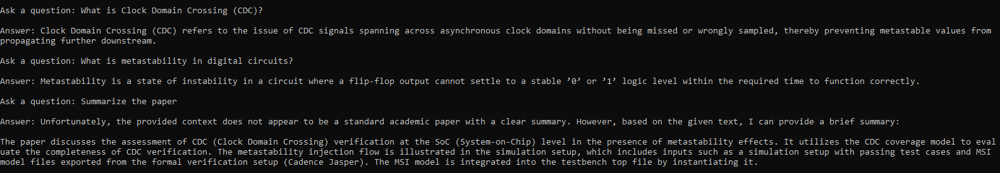

# EDA Documentation RAG Assistant
A RAG-based technical document Q&A system that enables natural language 
querying over EDA documentation using LangChain, ChromaDB, and Groq

## Problem It Solves
EDA tools have dense, complex documentation. This system lets you ask 
questions in plain English and get precise answers from the docs instantly.

## Architecture
- **Document Loading** - ingests EDA technical docs as text. Support PDF, TXT, DOCX formats
- **Chunking** - Documents are split into overlapping text segments to preserve context
- **Embeddings** - converts chunks into vector representations using all-MiniLM-L6-v2
- **Vector Store** - Embeddings are stored in ChromaDB for semantic similarity search.
- **Retrieval** - Top-K similarity search retrieves the most relevant document chunks.
- **LLM inferene** - The retrieved context is passed to a Groq-hosted Llama model to generate a grounded natural-language answer.

## Flow
Document ingestion → chunking → embedding → vector storage → retrieval → LLM answer generation.

## Tech Stack
LangChain · ChromaDB · Groq API · HuggingFace Embeddings · Python

## Setup
1. Clone the repo
2. Create virtual environment: `python -m venv venv`
3. Activate it: source venv/bin/activate
4. Install dependencies: `pip install -r requirements.txt`
5. Create `.env` file with: `GROQ_API_KEY=your_key_here`
6. Add your EDA docs as TXT/PDF/DOCX files to the `data/` folder
7. Run: `python app.py`

## Challenges and Observations

### PDF Table Extraction
Technical papers often contain tables that are poorly extracted by PDF parsers.  
This affects retrieval quality for structured content such as bug lists.

Mitigation strategies:
- larger chunk sizes
- improved prompts
- retrieving additional context chunks

## Example queries
- What is Clock Domain Crossing?
- What is metastability?
- Why is CDC verification important?
- What is the proposed verification methodology in the paper?
  
## Screenshots
Example interaction with the assistant:

## Future Improvements
